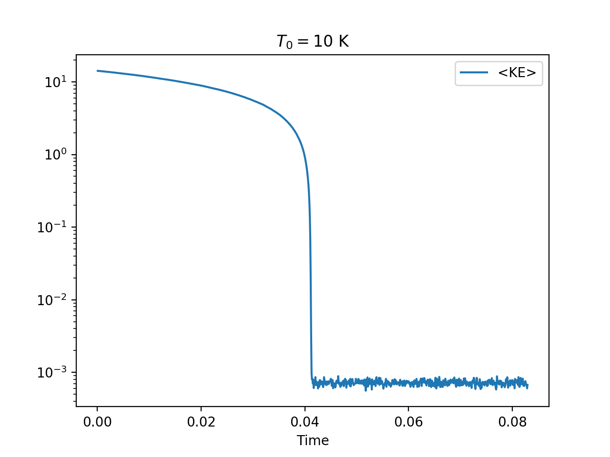

Simulation of the "optical molasses" laser cooling technique.

# General explanation
Atoms can absorb and emit photons at specific frequencies, which are intrinsic to the type of atom. Shining a laser on a cloud of atoms that is tuned slightly below a transition frequency allows for preferential absorption opposite to the direction of motion. If the atom is moving opposite the beam, the Doppler shift will raise the perceived frequency up to the proper resonance frequency, and increase the rate of absorption. If the atom is moving towards the beam, the Doppler shift will lower the perceived frequency, thus decreasing the rate of absorption.

Photons carry momentum, so the preferential absorption in the counter-propagating direction leads to an effective drag force, slowing the atoms down.

In this simulation, the atoms are assumed to emit absorbed photons in a random direction. This prevents the temperature from reaching absolute zero, since these random emissions, while having no *average* effect, cause even the coldest atoms to jiggle around a bit.

# Simulation details
## Absorption and emission
Six lasers are shone on the atoms, one in each Cartesian direction (forward and backward). Absorption and re-emission is assumed to be fast, so if an absorption event occurs, re-emission happens instantaneously (same time step). Absorption probability is computed from the known formula and the Doppler-shifted detuning. Emission happens in a random direction on the unit sphere.

## Detuning ramp
The simulation allows for the detuning to be linearly ramped over time. Set the initial and final detuning values, and the rate (slope) of the ramp. For constant detuning, either set the initial and final values to be the same, or set the ramp rate to be zero.

## Particle collisions
Pairs of particles can collide with each other in a random scattering event, which conserves their center-of-mass velocity and randomly rotating their relative velocity. This allows for the diffusion of energy, which helps with thermalization.

If there are N particles, then every time step, N/2 random "candidate pairs" are chosen, so that if all the collisions happened, every particle is expected to participate in one collision. Out of the candidate pairs, each randomly collides or doesn't collide with a probability dependent on the relative speed of the pair. The collision probablity comes from [this paper](http://www.physics.purdue.edu/~robichf/papers/PoP10_2217.pdf), and is computed by matching `<theta^2>` in the "random rotation" model implemented in this code to the theoretical value given in the paper.

# Usage
Run `make optmol` in the top-level directory, set the parameters in `/config/params_optmol.cfg`, then run `/bin/optical_molasses` with the particle species string as an argument. Optionally give the path to a non-default directory to write output to, and the path to a non-default configuration file to use.

## Species string
The particle species string sets the mass, decay rate, and transition frequency of the particle. These are hard coded with other fundamental constants in `constants.*pp`. Available species:

- "Rb": Rubidium atoms
- "BePlus": Beryllium+ ions

To add another species, add the three parameters to the constants files, add a clause to the beginning lines in `PhysicalParams.cpp` with the desired species string, and recompile. Then run the executable with the appropriate species string.

## Lab parameters
`params_optmol.cfg` contains different experimental parameters that might need to be changed. They are read at runtime and don't require recompilation to change. The following parameters have defaults, which can be used by setting the parameter to `nan`.

- initial_detuning: The optimal detuning, which leads to the greatest rate of energy decreasing, assuming the temperature is relatively high.
- final_detuning: -0.5. This leads to the minimum theoretical equilibrium temperature, i.e. the Doppler temperature.
- detuning_ramp_rate: Such that the ramp finishes exactly when the simulation ends.

## Hard-coded parameters
Hard coded at the top of `optical_molasses.cpp`, including parameters like the default configuration file name and the default output file base names. These shouldn't need to be modified, but if they do, simply change them and recompile.
