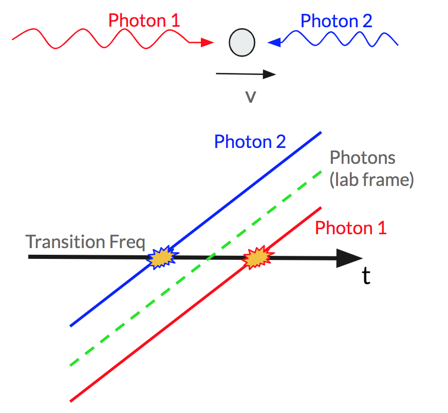
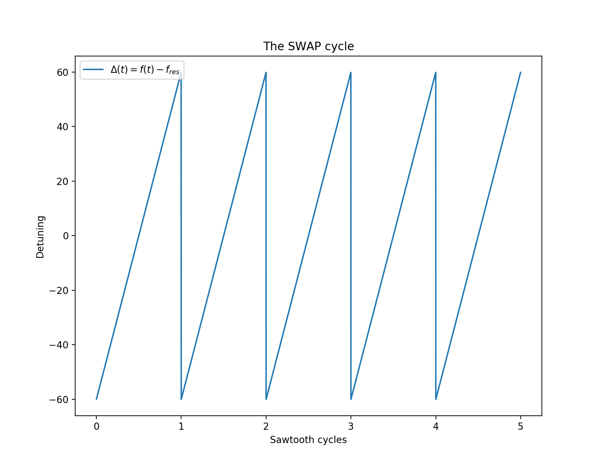
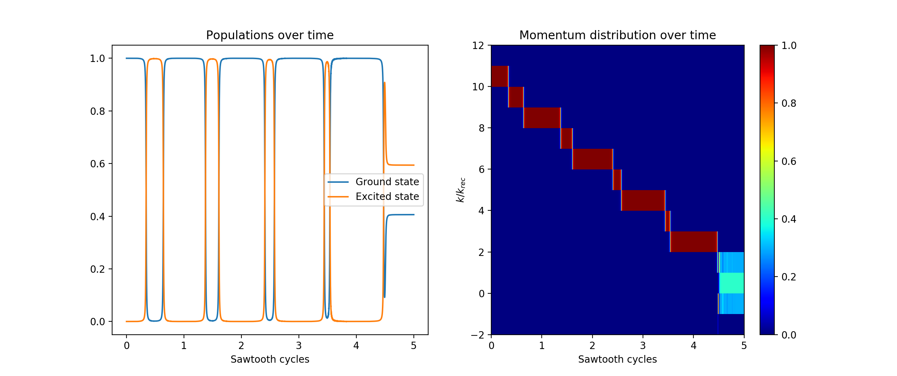
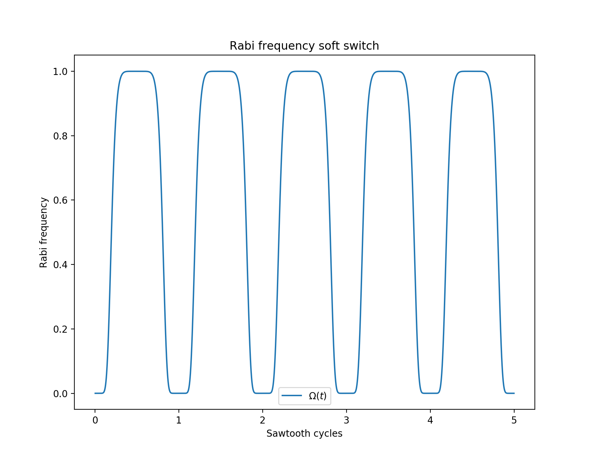

1-D density matrix simulation of the "sawtooth-wave adiabatic passage" (SWAP) laser cooling technique, [first demonstrated in 2018 with Strontium-88](https://iopscience.iop.org/article/10.1088/1367-2630/aaa950), and [described theoretically 6 months later](https://journals.aps.org/pra/references/10.1103/PhysRevA.98.023404).

# General explanation

The principle behind SWAP is similar to that of the ordinary [optical molasses](optmol.md). The difference is that instead of a constant laser frequency or a single frequency chirp, the frequency is repeatedly ramped in a sawtooth wave pattern (from low to high) about the resonance frequency (about zero detuning).

When the laser is just below the resonant frequency, the photon moving opposite to the particle is Doppler-shifted on resonance, and it gets absorbed and gives an momentum kick opposite to the particle's motion. Afterwards, when the laser is just above the resonant frequency, the photon moving in the same direction as the particle is Doppler-shifted on resonance, and it stimulates the already excited particle to emit a photon in the direction of its motion. The recoil from the emission gives the particle a second kick opposite to its motion.

Hence SWAP cools a particle with a repeated "double-kick" action each sweep. Over multiple sweeps, the particles cool down to close to their lowest momentum state. The zero-momentum state receives kicks that heat it up, which prevents the particles from approaching absolute zero.

# Advantages of SWAP cooling
SWAP cooling is a relatively new technique, and is not yet fully understood. However, it has a few promising properties compared to optical molasses.

## Cooling rate
The driven, double-kick drop in temperature means that SWAP can cool more rapidly than optical molasses. In optical molasses, after a particle receives an absorption kick, it cannot slow down any further until it spontaneously decays back to its ground state. SWAP, on the other hand, drives a particle both up and down the resonant transition, so the cooling is not necessarily bottlenecked by the spontaneous decay rate. The "double-kick" of SWAP also serves to increase its cooling speed. It has been demonstrated [through simulation](https://journals.aps.org/pra/references/10.1103/PhysRevA.98.023404) and [experimentally](https://journals.aps.org/pra/abstract/10.1103/PhysRevA.99.063414) that SWAP cooling is faster than optical molasses cooling.

## Open cycling transitions
SWAP's use of stimulated emission rather than spontaneous emission means it may be possible to use SWAP on transitions that aren't closed; i.e. the particle can spontaneously emit photons that make it decay to states *outside* of the two desired transition energy levels.

If there are only a few "leak" states, this is often solved with a *pump* laser that re-excites particles in the leak states back into the desired transition levels. However, for particles with many potential leak states, such as molecules (which have a myriad of vibrational, rotational, and electronic states), repumping is more difficult.

Since SWAP drives both excitation and decay, the particles are only in their excited states for short bursts, meaning there is little chance for spontaneous decay and thus little chance for leaking (at least in theory). One aim of these simulations is to explore how *branching* (i.e. leaking) affects the performance of SWAP cooling.

# Simulation details
There are two different simulation programs: `swapint` and `swapmotion`. As the names suggest, one simulates particle internal states, and the other also tracks particle motion. System dynamics are simulated quantum mechanically in 1-D by evolving the density matrix with the quantum master equations.

## Natural units
The simulation itself is done in natural units, meaning all the frequencies are normalized by the spontaneous decay rate. The spontaneous decay rate itself is specified in the configuration file in SI units. Time is measured in units of 1/(decay rate). The other parameters specified in SI units are the transition energy levels, the particle mass, and the initial temperature.

## Sawtooth cycle
The detuning is ramped in a sawtooth pattern with a given amplitude and frequency, which are both specified in the configuration file. "Frequency" in the sawtooth wave context means the inverse of the sawtooth period, and should not be confused with "frequency" in the sense that the quantity being ramped itself represents a laser frequency.

To prevent Gibbs ringing, the Rabi frequency is turned on via a soft switch. The maximum value of the Rabi frequency is specified in the configuration file. The window is of the form: `exp(-coeff|(t-t_mid)/t_mid|^power)`, where t_mid is the halfway point of the sawtooth cycle (when detuning passes zero). `coeff` and `power` are parameters specified in the configuration file. `coeff` controls the "narrowness" of the turn-on, with a higher value yielding a shorter "on" period. Setting `coeff = 0` gives a hard/instantaneous switch. `power` controls the "sharpness" of the turn-on, with a higher value yielding a faster rate of switching on to maximum value.

## Internal state simulation
`swapint` is a simulation of just particle internal states (unexcited, excited, etc.), without motional degrees of freedom. This is mainly just to observe the driven population transfer dynamics of SWAP.

### Tracked states
There are three internal states: 0, 1, and 2. The driven transition is between the lower state 1 and upper state 2. The energies of these states are specified in the configuration file. State 0 is the "leak" state, where particles can decay to from state 2 and never come back.

### Master equation
The Hamiltonian is the typical laser-atom Hamiltonian in the rotating wave approximation, where effective energies are given by +-(laser detuning)/2, and the transition amplitudes are given by half the Rabi frequency.

Spontaneous decay is controlled by the Lindblad superoperator, which adds an exponential decay term to state 2 and an exponential growth term to states 0 and 1. The rates of the growth terms are scaled by B and (1-B), where B is the "branching ratio" specified in the configuration file.

### Output
`swapint` outputs two files, `rho_*.out` and `cycles_*.out`, where the "*" is determined by the simulation parameters.

`rho_*.out` contains individual state population information at each time step.

`cycles_*.out` contains detuning, Rabi frequency, and total accumulated phase (integral of detuning with time) over time.

## Motional and internal state simulation
`swapmotion` simulates both particle internal states and motional degrees of freedom. The simulation of particle motion allows cooling to be observed.

`swapharmonic` simulates particle internal states and motional degrees of freedom when particles are held within a harmonic trap.

### Tracked states
In `swapmotion`, the momentum states ("k-states") are tracked in integer multiples of the recoil wave number, `k_rec = hbar*k_{laser}^2/(2*mass)`. The range of momentum states to track is specified in the configuration file. By default, states are tracked within 3 standard deviations of the initial thermal distribution. The number of standard deviations can be overriden. The range itself can also be explicitly specified. If the maximum k-state is given but not the minimum, the minimum will default to the negative of the maximum k-state. Both a maximum and a minimum k-state can be given as well, and need not be symmetric about k = 0 (or even contain k = 0, for that matter).

The internal states are identical to those in `swapint`. These are meshed with the momentum states to form the simulation basis.

In `swapharmonic`, instead of k-states, the discrete oscillator states |n> are tracked.

### Master equation
The Hamiltonian is similar to that of the internal state simulation, but it needs to couple the motional states. When a particle is excited or de-excited, its momentum state must either increase or decrease by one.

When a particle undergoes spontaneous decay, it can either drop to state 0 or state 1. If it drops to state 0, the momentum state is preserved. If it drops to state 1, it has a 1/5 chance of increasing or decreasing in momentum by one, and a 3/5 chance of staying at the same momentum state. The probabilities are motivated by a dipole radiation pattern `f(theta) ~ sin^2(theta)`.

For harmonic oscillator simulation, the Hamiltonian and spontaneous decay terms no longer just couple adjacent motional states, and instead have some degree of coupling between all states, the size of which is determined by projections of cos(kx) and e^(ikx) on oscillator states (i.e. <n'|cos(kx)|n> and <n'|e^(ikx)|n>).

#### Boundary conditions
For `swapmotion`, open boundary conditions are used for the momentum states. When the k-state gets too high or too low, it is lost from the simulation. Make sure to pick a large enough range of k-states to prevent excessive population loss.

For `swapharmonic`, the same is true for oscillator states.

### Output
`swapmotion` (`swapharmonic`) output three files, `rho_*.out`, `kdist_*.out` (`hdist_*.out`), and `kdist_final_*.out` (`hdist_final_*.out`), where the "*" is determined by the simulation parameters.

`rho_*.out` contains state population information at each time step, including the population in each internal state (traced across momentum states), the total trace (should stay close to 1), the "state purity" (Tr(rho^2)), the root-mean-square momentum value (proportional to the square root of the temperature), and the root-mean-square momentum value of just the "unleaked" population (in states 1 and 2).

`kdist_*.out` (`hdist_*.out` for `swapharmonic`) contains full momentum (oscillator state) distribution information at each time step, in a tall data format. Each line is labeled with a time value, a momentum (n for `swapharmonic`) value, and the proportions of the population in that momentum state (traced over internal state, and individually in states 0, 1, and 2).

`kdist_final_*.out` (`hdist_final_*.out` for `swapharmonic`) contains momentum (oscillator state) distribution information at just the final time, in the same format as `kdist_*.out` (`hdist_*.out`). This is redundant with `kdist_*.out` (`hdist_*.out`), and is mainly for convenience of analysis.

### Initial state
The initial momentum state population can be either set to a thermal (normal) distribution of a given temperature, or to a single pure momentum state. If the single momentum state field is specified as nan in the configuration file, a thermal state will be used. If an actual momentum state is given, it will override the temperature and initialize the system in a pure state.

### Cycle resetting
To prevent the buildup of coherences, which are detrimental to SWAP's performance, the density matrix is "reset" after every sawtooth cycle. In experiment, this would be equivalent to having a delay period between sawtooth cycles. In simulation, resetting means "fast-forwarding" in time by setting all coherences to zero, and forcing the decay of the excited state populations to be distributed between their ground state neighbors, in accordance with the dipole radiation pattern determining the Lindblad decay term.

# Usage
Run `make swapcool` in the top-level directory, set the parameters in `/config/params_swapcool.cfg` and/or `/config/params_swapharmonic.cfg`, then run `/bin/swapint`, `/bin/swapmotion`, and/or `/bin/swapharmonic`. Optionally give the path to a non-default directory to write output to, and the path to a non-default configuration file to use. For `swapmotion` and `swapharmonic`, a final optional parameter, `--batch-mode` (or `-b` for short) can be specified to enable batch mode, which suppresses all console output.

## OpenMP Capability
If OpenMP is available on your machine, enable it by adding the appropriate compiler/linker flags when running make. I.e. compile swapcool with `make swapcool CFLAGS=-openmp FLAGS=-fopenmp`.

Set the number of threads with the environment variable `OMP_NUM_THREADS`. E.g. specify 4 threads by running `export OMP_NUM_THREADS=4`.

## Lab parameters
`params_swapcool.cfg` contains different experimental parameters that might need to be changed. They are read at runtime and don't require recompilation to change. `swapint` and `swapmotion` are made to use a shared set of parameters, with swapmotion having some extra ones. Configuration files can be shared between the two programs; `swapint` will ignore the `swapmotion`-only parameters.

`params_swapharmonic.cfg` contain experimental parameters for simulating SWAP in a harmonic trap. Many parameters are shared with `params_swapcool.cfg`, but there are some extra ones specifically for the harmonic oscillator.

## Hard-coded parameters
Hard coded at the top of `swapint.cpp`, `swapmotion.cpp`, and `swapharmonic.cpp`, including parameters like the default configuration file name and the default output file names. These shouldn't need to be modified, but if they do, simply change them and recompile.
